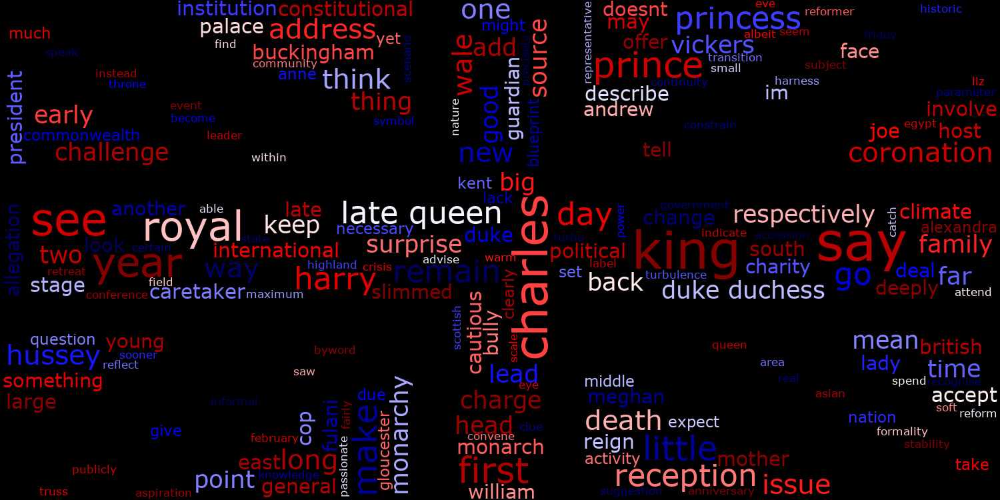

<h1 align="center">
   
  
   
  Article Analyzer NLP
   
</h1>
<h4 align="center">Extract article's text from web page, transform, load to working directory, analyze content and visualize.</h4>

  <a href="#general-info">General Info</a> •
  <a href="#features">Features</a> •
  <a href="#prerequisites">Prerequisites</a> •
  <a href="#how-to-use">How to use</a> •
  <a href="#inspiration">Inspiration</a>

## General Info

### Features
* a
* b
* c

**Challenges encountered:**

**Ideas for future development:**

## Getting Started

### Prerequisites
* Python - version 3.9.7
* beautifulsoup4 - version 4.10.0
* numpy - version 1.26.4
* requests - version 2.26.0
* trafilatura - version 1.7.0
* spacy - version 3.7.4
* nltk - version 3.8.1
* pandas - version 2.2.1
* matplotlib - version 3.8.3
* mycolorpy - version 1.5.1
* pillow  version 10.2.0
* wordcloud - version 1.9.3
* python-docx - version 1.1.0

### How to use

## Inspiration

